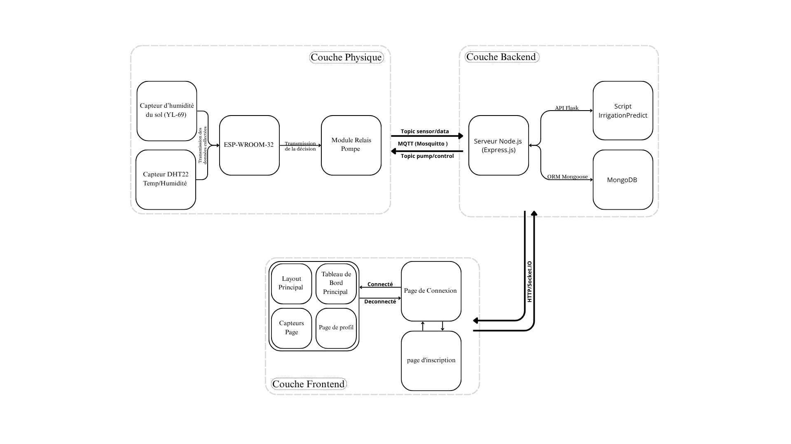
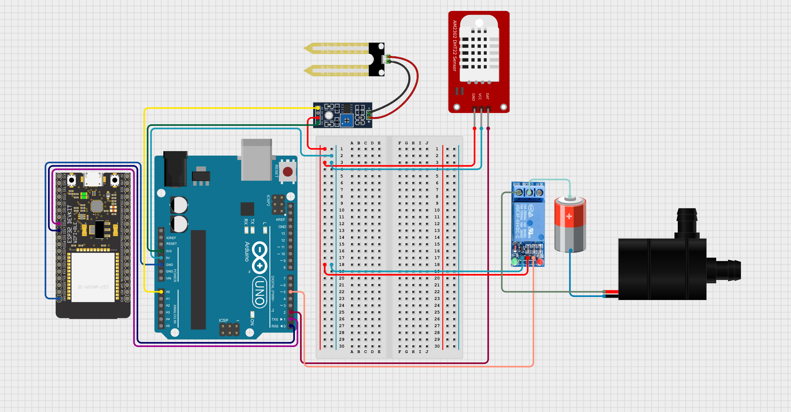

# SMARTGROW : Systéme d'irrigation inteligent basé sur l'IA et l'IOT 
SmartGrow est une solution d’irrigation intelligente qui associe l’Internet des Objets (IoT) à l’Intelligence Artificielle (IA) pour optimiser la gestion de l’eau en agriculture.
Elle collecte en temps réel des données environnementales et utilise un modèle d’IA pour prendre des décisions précises en matière d’irrigation.

# Features
Collecte en temps réel des données environnementales (capteurs IoT)

Prise de décision automatisée via un modèle d’IA

Gestion intelligente de l’irrigation pour réduire la consommation d’eau

Interface web intuitive pour visualiser les données et contrôler le système

# Architecture Technique
L’architecture de SmartGrow est modulaire et organisée en trois couches : la couche physique (capteurs, ESP32, Arduino UNO et actionneurs), la couche backend (serveur et script IrrigationPredict) et la couche frontend (interface web)

# Prérequis
Avant d’installer et d’exécuter SmartGrow, assurez-vous d’avoir configuré tous les éléments suivants :

     Matériel (Hardware – IoT):    
      -Carte ESP32 (ESP-WROOM-32)        
      -Carte Arduino UNO        
      -Capteur DHT pour température / humidité        
      -Capteur  YL 69 pour humidité du sol        
      -Relay 5v
      -Pomp
  
  
    
    Hardware IDE:
      VS Code/Environnement PlatformIO avec les bibliothèques: Arduino, DHT, ArduinoJson, WiFiManager, EEPROM, PubSubClient, esp_task_wdt

    Backend:
     -Serveur Node.js:
          Node.js
          Bibliothèques : Express, HTTP, CORS, Socket.IO, MQTT, Axios, Mongoose, Bcrypt.js, JWT
          
      -Script d’Irrigation (IA):
          Python 3
          Bibliothèques : Flask, Flask-CORS, Joblib, Pandas, NumPy, Scikit-learn (ensemble)
          
      -Serveur Node.js:
          MongoDB en local
          Mosquitto (broker MQTT) en local

    Frontend: React, CSS, npm
    
    Protocol: MQTT

# Utilisation
    Premièrement, branchez l’ESP et l’Arduino successivement, puis téléversez le code sur chacun.
    1.Démarrer MongoDB et Mosquitto
    2.Lancer le serveur Node.js :
        node server.js
    3.Lancer le script (IrrigationPredect)
    4.Lancer l’interface web:
        npm start
    5.Accéder à l’interface web
    6.Branche l'esp et l'arduino 
    → Un point d’accès nommé SmartGrow sera hébergé par l’ESP
    7.Connectez-vous à ce point d’accès à partir d’un autre appareil (mobile/PC) — mot de passe : password
    8.Entrez les informations du Wi-Fi et l’adresse IP (IPv4) du PC
